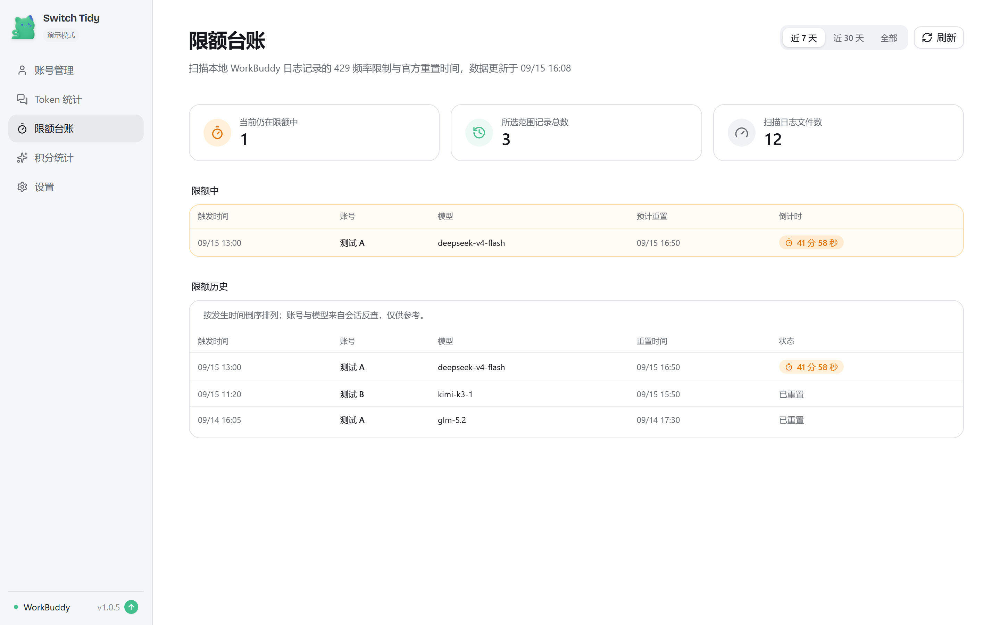
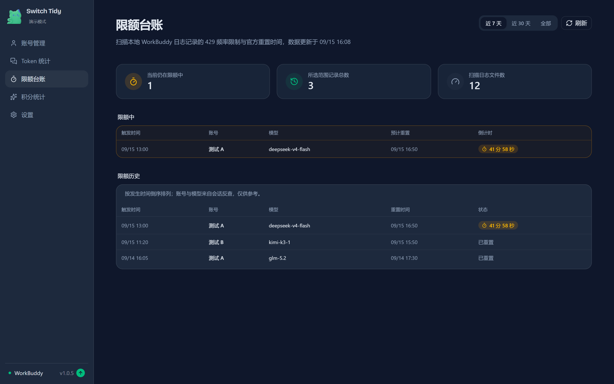

# workbuddy-switch-tidy

WorkBuddy（腾讯 AI 编程助手）多账号切换工具。

本项目 fork 自 [changexbc/workbuddy-switch](https://github.com/changexbc/workbuddy-switch)，在保留上游全部功能的基础上，修复了多账号使用场景中的若干实际问题。

<p align="center">
  
</p>

<p align="center">
  <strong>workbuddy-switch-tidy</strong><br />
  WorkBuddy 多账号切换工具
</p>

---

## 下载

### 桌面 App（Windows 单 EXE）

前往 [Releases](https://github.com/heylumen/workbuddy-switch-tidy/releases/latest) 下载最新版：

| 平台 | 文件 | 使用方式 |
| --- | --- | --- |
| Windows x64 | `workbuddy-switch-tidy_<版本>.exe` | 双击直接运行，无需安装 |

**首次运行**：Windows SmartScreen 可能提示「Windows 已保护你的电脑」，点击「更多信息」→「仍要运行」即可。

> 应用会自动检查 GitHub Releases 并提示新版本，但不做应用内自动下载安装；升级时请到 [Releases](https://github.com/heylumen/workbuddy-switch-tidy/releases/latest) 手动下载新版本替换。

### npm / webui（跨平台）

macOS / Linux 暂无预编译 EXE，可通过 npm 使用：

```bash
npm i -g workbuddy-switch
workbuddy-switch              # 启动 WebUI 服务 + 自动打开浏览器
workbuddy-switch status       # 终端查看当前账号
```

webui 界面与桌面 App 一致。

---

## 功能

| 模块 | 说明 |
| --- | --- |
| 账号管理 | OAuth 扫码登录、从本机导入、手动添加 token、删除账号 |
| 账号切换 | 备份认证文件 → 关闭 WorkBuddy → 写入目标账号 → 重启，切换过程实时进度反馈 |
| 会话复制 | 将勾选会话复制给目标账号；**复制前自动去重**，目标已存在等价会话则跳过 |
| 清理重复会话 | 按「工作目录 + jsonl 正文逐字一致」合并副本，每组保留最近更新的一条 |
| 折叠同名会话 | 按「工作区 + 标题」收起视图冗余，专治切换账号反复复制导致的同名重复 |
| 自动签到 | 默认开启；启动时立即检查，运行期间每 30 分钟自动补签；30 天签到日志 |
| Token 保活 | 惰性刷新 + 每日保活，避免 refresh token 过期 |
| 积分到期查询 | 查询各账号积分资源、剩余量与到期时间；7 天内到期高亮并按到期优先排序 |
| 积分统计 | 汇总官方请求用量，展示每日趋势、模型分布、账号消耗与请求明细 |
| Token 统计 | 分别查看 WorkBuddy 与 CodeBuddy CLI 的 Token 总览；输入、输出、缓存读写按 K/M/B 展示，趋势图同时呈现每日 Token 构成与调用次数，并提供构成占比、热力图、项目/模型 Top 10 和会话排行 |
| 限额台账 | 扫描本地 429 频率限制日志（`~/.workbuddy/logs/`），展示限额历史表与当前仍在限额中的实时倒计时；账号/模型来自会话反查（仅供参考），数据完全来自本机日志、不调用接口 |
| CodeBuddy CLI | 与 WorkBuddy 复用账号库，默认账号独立；Windows 通过 `settings.json.env.CODEBUDDY_AUTH_TOKEN` 设置 |
| CodeBuddy CN IDE | 向国内版桌面客户端注入 Safe Storage 凭证（`state.vscdb`）并重启 IDE；与 CodeBuddy CLI、国际版 CodeBuddy 相互独立 |
| 自动轮换 | 后台定时把 CLI 后续启动账号设为积分最紧迫的账号 |
| 权限检测 | macOS 授权引导（App 管理 / 完全磁盘访问） |

### 两个整理功能的区别

| | 清理重复会话 | 折叠同名会话 |
| --- | --- | --- |
| 判定依据 | 工作目录相同 **且** 正文逐字一致 | 工作区 + 标题（同标题不同内容**也会折叠**） |
| 处理对象 | 切换复制产生的完全相同的副本 | 同一对话被反复复制产生的同名冗余 |
| 数据风险 | **较高**：会删除 jsonl 正文，不可恢复 | **低**：仅软隐藏，正文留盘可找回 |
| 数据处理 | 软删除（标记 `deleted_at`）+ 删除正文 | 软隐藏（标记 `deleted_at`），**jsonl 正文原样留盘** |
| 结果 | 列表中的重复项消失 | 左栏「空间 / 任务」每个同名分组只显示最新一份 |

> 折叠之所以敢按「同标题」放宽，是因为它**不删正文**、随时可恢复；清理会真删文件，因此必须要求正文逐字一致才动手。

> 两者都只作用于**所选账号**，都需**先关闭 WorkBuddy** 再执行。

---

## 使用

1. **添加账号**：账号页 →「扫码登录」或「从本机导入」「手动添加」
2. **切换账号**：账号卡片 →「切换」，可勾选复制当前会话
3. **查看积分**：账号页自动查询；点「刷新积分」手动更新，临期账号排最前并标记「建议优先」
4. **整理重复会话**：点账号卡片右上角的 **⋮ 菜单**，选择「清理重复会话」或「折叠同名会话」（**执行前请关闭 WorkBuddy**）
5. **CodeBuddy CLI**：账号页一键接入；切换只影响后续会话，当前会话需重新加载或重启 CLI
6. **查看 Token 统计**：侧栏进入「Token 统计」，选择 WorkBuddy 或 CodeBuddy CLI，查看输入、输出、缓存读写与调用次数
7. **查看限额台账**：侧栏进入「限额台账」，查看近期 429 频率限制记录、重置时间与当前仍在限额中的倒计时
8. **CodeBuddy IDE**：账号卡片一键切换国内版 CodeBuddy CN IDE；首次使用前请先手动打开并登录一次，以生成 Keychain Safe Storage；切换会关闭并重启 IDE
9. **更新版本**：应用会自动检查新版本并提示；升级请到 [Releases](https://github.com/heylumen/workbuddy-switch-tidy/releases/latest) 手动下载替换

---

## 界面预览

### 账号管理

账号卡片集中展示登录状态、签到状态、积分余额与到期资源。临期积分直接标注在卡片内，并按紧迫程度优先排列。

<table>
  <thead>
    <tr><th>浅色模式</th><th>深色模式</th></tr>
  </thead>
  <tbody>
    <tr>
      <td></td>
      <td></td>
    </tr>
  </tbody>
</table>

### 积分统计

展示官方请求用量、每日趋势、模型分布、账号消耗与请求明细，并明确标注数据来源与更新时间。

<table>
  <thead>
    <tr><th>浅色模式</th><th>深色模式</th></tr>
  </thead>
  <tbody>
    <tr>
      <td></td>
      <td></td>
    </tr>
  </tbody>
</table>

> 以上截图取自上游项目，功能与布局一致；本项目的侧边栏品牌名为 `Switch Tidy`。

### Token 统计

按来源展示 Token 总览与每日趋势：输入、输出、缓存读写使用 K/M/B 紧凑单位，趋势图用堆叠柱表示每日 Token 总量与构成、虚线表示调用次数；同时提供 Token 构成占比、活跃热力图、项目/模型 Top 10 与会话排行，帮助快速定位主要消耗来源。

### 限额台账

扫描本地 429 频率限制日志，概览卡展示当前仍在限额中的数量；「限额中」表格实时倒计时显示哪个账号的哪个模型还有多久解锁，「限额历史」保留近期全部触发记录。

<table>
  <thead>
    <tr><th>浅色模式</th><th>深色模式</th></tr>
  </thead>
  <tbody>
    <tr>
      <td></td>
      <td></td>
    </tr>
  </tbody>
</table>

> 限额台账为本 fork 新增功能，以上截图取自演示模式（脱敏演示数据）。

---

## 更新日志

### v1.0.5（最新）

- 新增**限额台账**：扫描本地 WorkBuddy 日志（`~/.workbuddy/logs/`）解析模型 429 频率限制记录与官方重置时间，侧栏新增「限额台账」页面
  - 限额历史表（触发时间 / 账号 / 模型 / 重置时间 / 状态）与当前仍在限额中的实时倒计时，一眼看到哪个账号的哪个模型现在受限、还有多久解锁
  - 同一 429 事件在业务日志与 SDK 日志的多份记录自动去重，不重复计入
  - 账号通过 workbuddy.db 会话归属反查、模型通过会话 jsonl 反查（日志无模型名，仅供参考）
  - 数据完全来自本机日志，不调用任何接口

### v1.0.4

- 对齐上游 `changexbc/workbuddy-switch` 0.1.35 ～ 0.1.37 全部 8 个提交，既有自定义功能全部保留
- 新增 **派猫猫旅行** 自动派发与奖励领取：启动即派发一轮，之后周期性补派（含 no-buddy 与瞬时错误重试）与到点领取；账号卡片新增旅行状态标签（无 Buddy / 未旅行 / 旅行中（含剩余时间与预计奖励）/ 已结束），设置页支持自动旅行开关
- Token 统计新增 CodeBuddy IDE 用量来源，与 WorkBuddy / CodeBuddy CLI 并列查看
- 积分查询对齐官网请求指纹（统一桌面 Chrome User-Agent），失败时完整展示官方返回原因，便于定位账号问题
- 修复会话复制导致的 Token 统计虚高：同一条请求此前会随副本被重复计入（实测极端场景单日虚高可达二十余倍），现在全局仅统计一次、用量归属原始会话；无时间戳的旧格式记录保持原逻辑不计入去重
- **修复托盘图标左键单击误弹菜单的问题**：左键单击改为唤起主界面，菜单仅在右键单击时弹出
- 侧栏底部版本区改版：版本号内联展示，发现新版本时显示醒目的圆形升级按钮（悬停有提示）
- 修复 `cargo build --release` 未运行 vite 时误产出开发模式 exe 的问题（新增 custom-protocol 默认 feature）
- 账号卡片「建议优先」改为星标图标（悬停提示）、积分查询失败原因支持完整展示不再截断

---

## 从源码构建

需要 Node.js 22+ 与 Rust 工具链（Windows 另需 MSVC Build Tools 与 WebView2）。

```bash
npm install
npm run tauri build
```

产物位于 `target/release/`。

---

## 数据目录

- 账号与配置：`~/.wb-switch/`
- WorkBuddy 会话数据：`~/.workbuddy/`

> 本工具不改动数据表结构，仅在整理会话时标记会话可见性（`deleted_at`）。
> ⚠️ 执行「清理重复会话」「折叠同名会话」等写库操作前，请务必关闭 WorkBuddy 客户端，避免 SQLite 锁冲突。

---

## 致谢

- 上游项目 [changexbc/workbuddy-switch](https://github.com/changexbc/workbuddy-switch) 及 [Linux.do](https://linux.do) 社区

## 许可

[MIT](./LICENSE)
